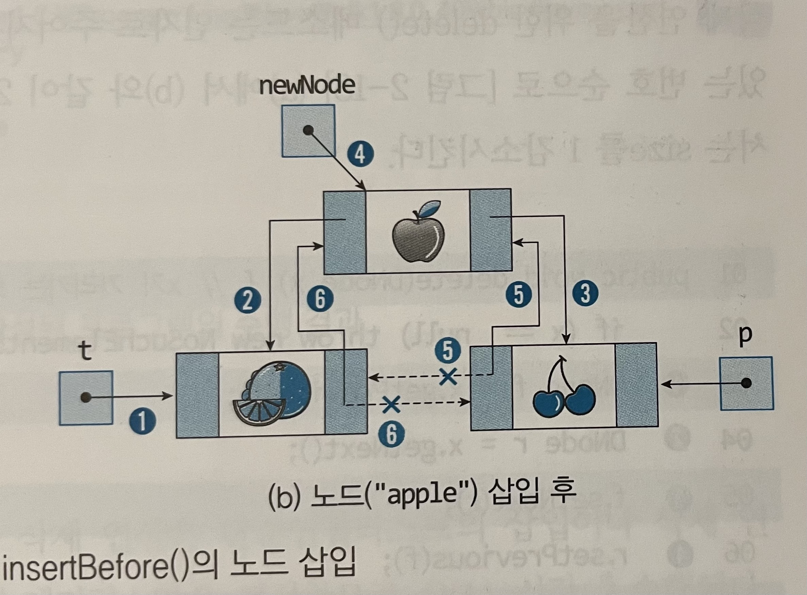
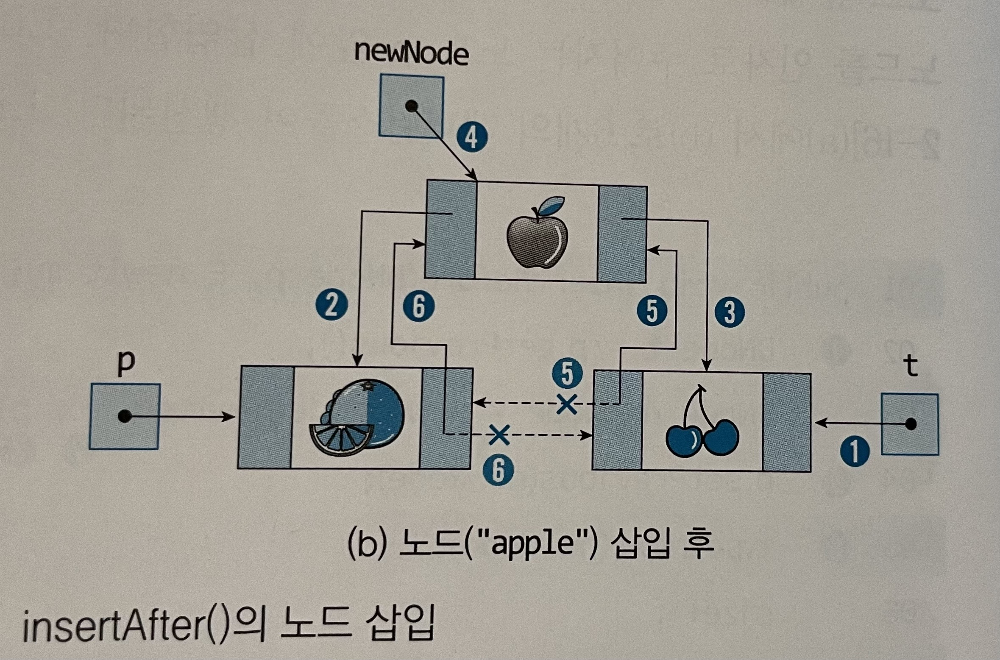
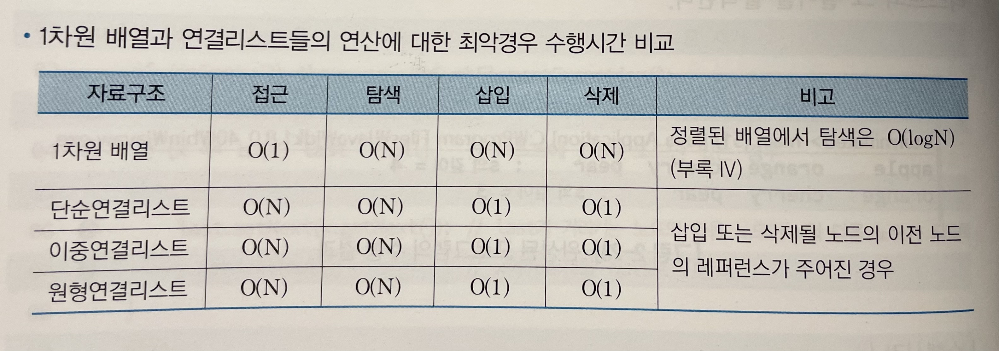

# 2. 리스트
리스트는 일련의 동일한 타입의 항목들을 의미한다. (스택과 큐 자료구조도 리스트의 일종임) 기본연산으로 탐색, 삽입, 삭제가 있다.

## 2.1 배열
동일한 타입의 원소들이 연속적인 메모리 공간에 할당되어 각 항목이 하나의 원소에 저장되는 기본적인 자료구조이다.
또 특정 원소에 접근시 배열의 인덱스를 이요하여 O(1)시간에 접근할 수 있다.

그러나 새 힝목이 배열 중간에 삽입되거나, 중간에 있는 항목이 삭제되면 뒤따르는 항목들을 이동시켜야 하므로 삽입, 삭제 연산은 항상 O(1)시간에 수행할 수 없다.   
또 미리 정해진 크기의 메모리 공간을 할당 받은 뒤 사용해야 하므로 빈자리가 없어 새 항목을 삽입할 수 없는 상황 Overflow에 직면할 수 있다.   
이때 overflow 발생시 배열 크기를 2배로 확장하여 사용할 수도 있다.(동적배열)

## 2.2 단순 연결 리스트
동적 메모리 할당을 이용해 리스트를 구현하는 가장 간단한 형태의 자료구조이다. 동적 메모리를 할당 받아 노드를 저장하고, 다음 노드를 가리키도록 만들어 노드들을 한 줄로 연결시킨다.   
연결리스트에서는 삽입이나 삭제시 항목들의 이동이 필요 없다. 또 연결리스트는 빈 공간이 존재하지 않는다.

다만 항목을 탐색할 때 항상 첫 노드부터 원하는 노드를 찾을때까지 순차탐색을 해야만 한다. 또 노드마다 레퍼런스를 저장할 공간이 필요하다.
```
public class Node<E> {
    private E item;         //항목 저장
    private Node<E> next;   //Node 레퍼런스 저장
    
    //생성자
    public Node(E newItem, Node<E> node) {
        item = newItem;
        next = node;
    }
    
    public E getItem() { return item; }
    public Node<E> getNext() { return next; }
    public void setItem(E newItem) { item = newItem; }
    public void setNext(Node<E> newNext) { next = newNext; }
    
}
```
```
//1. 첫 노드 앞에 삽입
public void insertFront(E newItem) {
    head = new Node(newItem, head);
    size++;
}

//2. 특정 노드 p 뒤에 삽입
public void insertAfter(E newItem, Node p) {
    p.setNext(new Node(newItem, p.getNext()));
    size++;
}

//3. 첫 노드 삭제
public void deleteFront() {
    if(isEmpty()) throw new Excetion();
    
    head = head.getNext();
    size--;
}

//4. 특정 노드 p 삭제
public void deleteAfter(Node p) {
    if(p == null) throw new Exception();
    
    Node t = p.getNext();
    p.setNext(t.getNext());
    t.setNext(null);
    size--;
}
```
탐색의 경우 첫 노드부터 순차적으로 방문해야 하므로 O(N) 시간이 소요되고, 삽입이나 삭제 연산은 각각 상수개의 레퍼런스를 갱신하므로 O(1) 시간이 소요된다.

## 2.3 이중연결리스트
각 노드가 두 개의 레퍼런스를 가지고 각각 이전 노드와 다음 노드를 가리키는 연결리스트이다.
```
public class DNode <E> {
    private E item;
    private DNode previous;
    private DNode next;
    public DNode(E newItem, DNode p, DNode q) {
        item = newItem;
        previous = p;
        next = q;
    }
    
    //getter, setter..
}

public class DList <E> {
    protected DNode head, tail;
    protected int size;
    public DList() {
        head = new DNode(null, null, null);
        tail = new DNode(null, head, null);
        head.setNext(tail);
        size = 0;
}
```
```
//1. 삽입연산 : p가 가리키는 노드 앞에, 뒤에 삽입하는 두 메서드 구현
public void insertBefore(DNode p, E newItem) {
    DNode t = p.getPrevious();
    DNode newNode = new DNode(newItem, t, p);
    p.setPrevious(newNode);
    t.setNext(newNode);
    size++;
}

public void insertAfter(DNode p, E newItem) {
    DNode t = p.getNext();
    DNode newNode = new DNode(newItem, p, t);
    t.setPrevious(newNode);
    p.setNext(newNode);
    size++;
}
```



```
//2. 삭제연산
public void delete(DNode x) {
    if(x == null) throw new Exception();
    DNode f = x.getPrevious();
    DNode r = x.getNext();
    f.setNext(r);
    r.setPrevious(f);
    size--;
```
이중연결리스트에서는 각각 상수 개의 레퍼런스만을 갱신하므로 O(1) 시간에 수행된다. 탐색 연산의 경우 첫 노드부터 마지막 노드까지 순차적으로 탐색해야하므로 O(N)시간이 소요된다.

## 2.4 원형연결리스트
마지막 노드가 첫 노드와 연결된 단순연결리스트이다. 마지막 노드와 첫 노드를 O(1)시간에 방문할 수 있는 장점을 가지고, 리스트가 empty가 아니면 어떤 노드도 null 레퍼런스를 가지고 있지 않으므로 프로그램에서
null 조건을 검사하지 않아도 된다는 장점을 가진다.

반면 반대 방향으로 노드들을 방문하기 쉽지 않고, 무한 루프가 발생할 수 있음에 유의할 필요가 있다.
```
public class CList<E> {
    private Node last;
    private int size;
    public CList() {
        last = null;
        size = 0;
    }
}

//1. 삽입연산
public void insert(E newItem) {
    Node newNode = new Node(newItem, null);
    if(last == null {
        newNode.setNext(newNode);
        last = newNode; //node가 하나뿐이라 last도 자기 자신을 가리킴
    }else {
        newNode.setNext(last.getNext());
        last.setNext(newNode);
    }
    size++;
}

//2. 삭제연산
public Node delete() {
    if(isEmpty()) throw new Exception();
    Node x = last.getNext();    //x가 리스트의 첫 노드를 가리킴
    
    if(x == last) last = null;  //리스트에 한 개의 노드만 있는 경우
    else {
        last.setNext(x.getNext());
        x.setNext(null);
    }
    size--;
    return x;
}
```
삽입, 삭제 연산의 경우 상수 개의 레퍼런스를 갱신하므로 O(1) 시간 수행된다. 탐색 연산의 경우 순차적으로 탐색하므로 O(N)시간이 소요된다.
