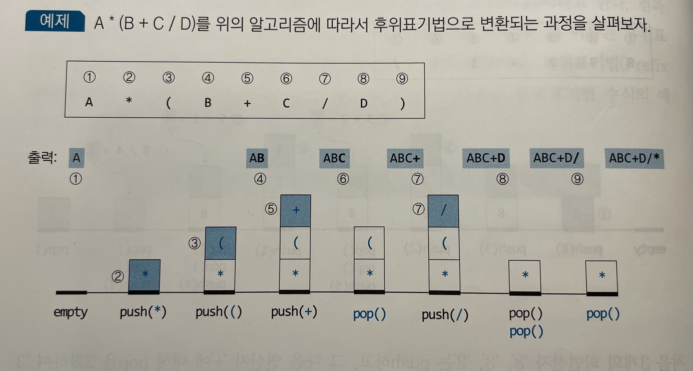

# 3. 스택과 큐
스택과 큐는 일상에서 쉽게 접할 수 있는 자료구조이다 스택은 인터넷 브라우저에서 뒤로가기, 앞으로가기 버튼 등, 큐는 대기열로 은행 등에서 번호표를 받아서 자신의 순서를 기다리는 경우이다.

## 3.1 스택
스택은 한 쪽 끝에서만 item을 삭제(pop)하거나 새로운 item을 삽입(push)하는 자료구조이다.   
스택에서는 항상 가장 위에서 push나 pop 연산을 수행하므로 스택의 가장 위의 item을 가리키고 있는 변수(top)가 필요하다. 스택이 empty인 경우 top = -1

__[배열로 스택 구현]__
```
public class ArrayStack<E> {
    private E s[];
    private int top;
    public ArrayStack() {
        s = (E[]) new Object[1];
        top = -1;
    }
    public int size() { return top+1; }
    public boolean isEmpty() { return (top == -1); }
    
    //1. peek() : 스택 가장 위에 있는 item을 리턴한다.
    public E peek() {
        it(isEmpty()) throw new Exception();
        return s[top];
    }
    
    //2. push() : 새 item을 스택에 삽입
    public void push(E newItem) {
        if(size() == s.length) resize(2 * s.length);    //배열이 가득 찼다면 배열크기를 확장시킨다.
        
        s[++top] = newItem;
    }
    
    //3. pop() : 스택의 top item을 삭제한 후 리턴
    public E pop() {
        if(isEmpty()) throw new Exception();
        E item = s[top];
        s[top--] = null;    //s[top]를 null로 초기화 하고 top를 -1해준다.
        
        //item수가 배열의 1/4만 차지하게 될 때 메모리 낭비를 줄이기 위해 배열의 크기를 축소시킨다.
        if(size() > 0 && size() == s.length/4) resize(s.length/2);  
        
        return item;
    }
}
```

__[단순연결리스트로 스택 구현]__
```
public class ListStack <E> {
    private Node<E> top;
    private int size;
    public ListStack() {
        top = null;
        size = 0;
    }
    public int size() { return size; }
    public boolean isEmpty() { return size == 0; }
    
    //1. peek()
    public E peek() {
        if(isEmpty()) throw new Exception();
        
        return top.getItem();
    }
    
    //2. push()
    public void push(E newItem) {
        Node newNode = new Node(newItem, top);
        top = newNode;
        size++;
    }    
    
    //3. pop()
    public E pop() {
        if(isEmpty()) throw new Exception();
        
        E topItem = top.getItem();
        top = top.getNext();
        size--;
        return topItem;
    }    
```

#### 1) 괄호 짝 맞추기 문제
스택을 이용해서 좌에서 우로 괄호를 읽어가며 괄호들을 검사한다. 왼쪽 괄호를 읽으면 스택에 push, 오른쪽 괄호를 읽으면 pop 수행한다.   
pop된 왼쪽 괄호와 바로 읽은 오른쪽 괄호가 다른 종류면 에러처리하고 같은 종류면 다음 괄호를 읽는다. 에러가 없고 empty라면 정상   


#### 2) 회문 검사하기
회문이란 앞으로부터 읽으나 뒤로부터 읽으나 같은 스트링을 말한다.   
전반부 문자들을 스택에 push하고 후반부의 각 문자를 차례로 pop한 문자와 비교한다. 문자열 길이가 짝수이면, 뒷부분의 문자를 읽을때마다 pop하여 비교하는 과정 수행
마지막 비교까지 두 문자가 동일하고 스택이 empty가 되면 입력 문자열은 회문이다.

문자열 길이가 홀수인경우 앞부분 반을 읽어 스택에 push한 후 중간 문자를 읽고 버린다. 그리고 짝수 경우와 동일하게 비교를 수행


#### 3) 후위표기법 수식 계산
* 중위 표기법 : +, -, * 같은 이항연산자는 2개의 피연산자들 사이에 위치한다. 이러한 방식의 수식 표현을 중위 표기법이라고 한다. 컴파일러는 중위표기법을 후위표기법으로 바꾼다.
* 전위 표기법: 연산자를 피연산자들 앞에 두는 표기법인다.


후위표기법 수식 계산시 피연산자는 스택에 push하고, 연산자는 2회 pop하여 계산한 후 push한다.


#### 4) 중위표기법 수식을 후휘표기법으로 변환
왼쪽 괄호나 연산자는 스택에 push하고, 피연산자는 출력한다.

1) 읽을 문자가 피연산자이면, 읽은 문자를 출력
2) 왼쪽 괄호이면 push
3) 오른쪽 괄호이면 왼쪽 괄호가 나올 때까지 pop하여 출력, 단 괄호는 출력하지 않는다.
4) 연산자이면 자신의 우선순위보다 낮은 연산자가 스택 top에 올 때까지 pop하여 출력하고 읽은 연산자를 push 한다.
5) 입력을 모두 읽었으면 스택이 empty될 때까지 pop하여 출력한다.



### 수행시간
배열로 구현한 스택의 push, pop은 각각 O(1) 시간이 소요된다. 그러나 배열 크기를 확대 또는 축소시키는 경우 스택의 모든 item들을 새 배열로 복사해야 하므로 O(N)시간이 소요된다.

단순연결리스트로 구현한 스택의 push, pop 연산은 각각 O(1)시간이 걸리는데 연결리스트 앞 부분에서 노드를 삽입하거나 삭제하기 때문이다. 