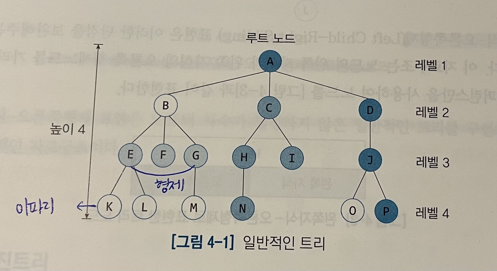
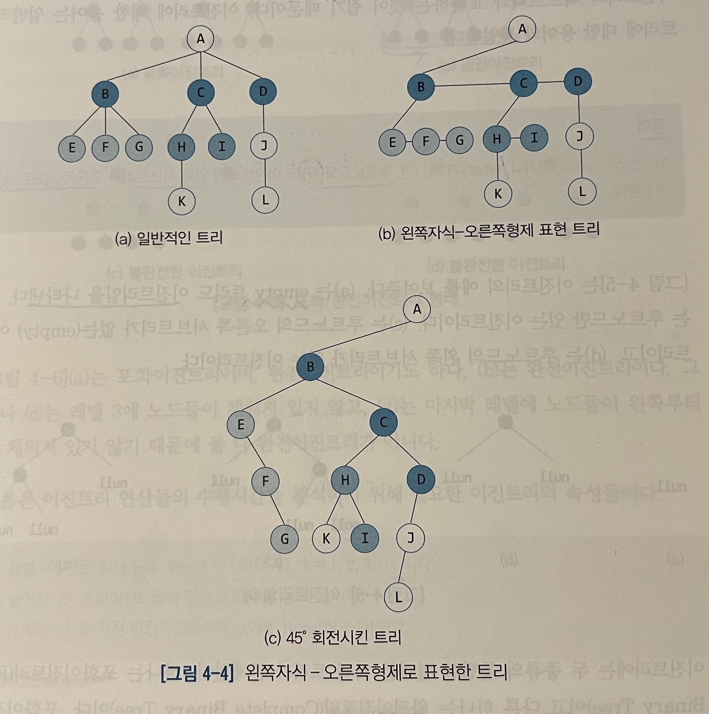
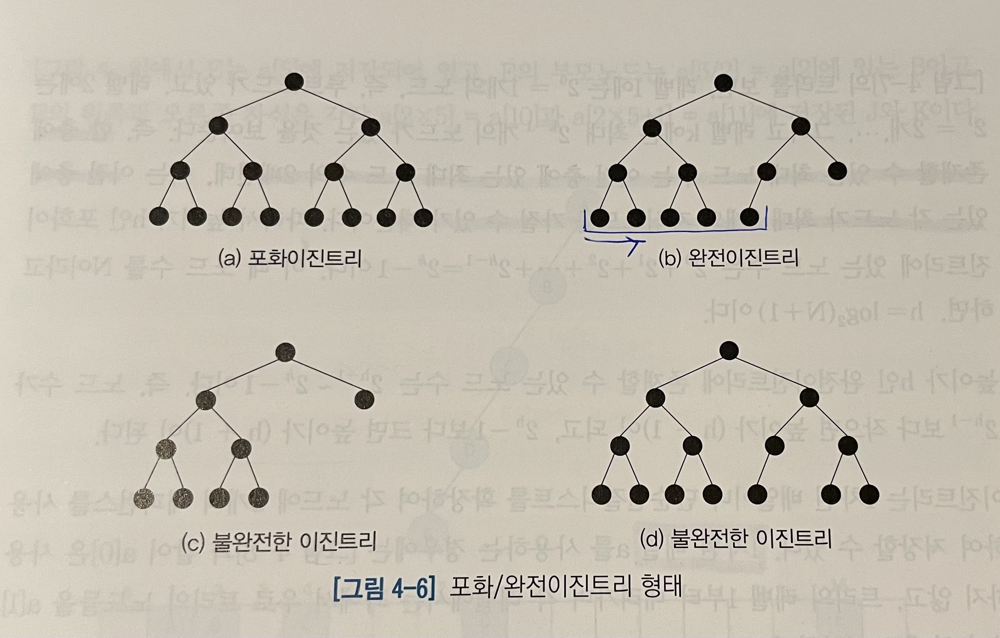
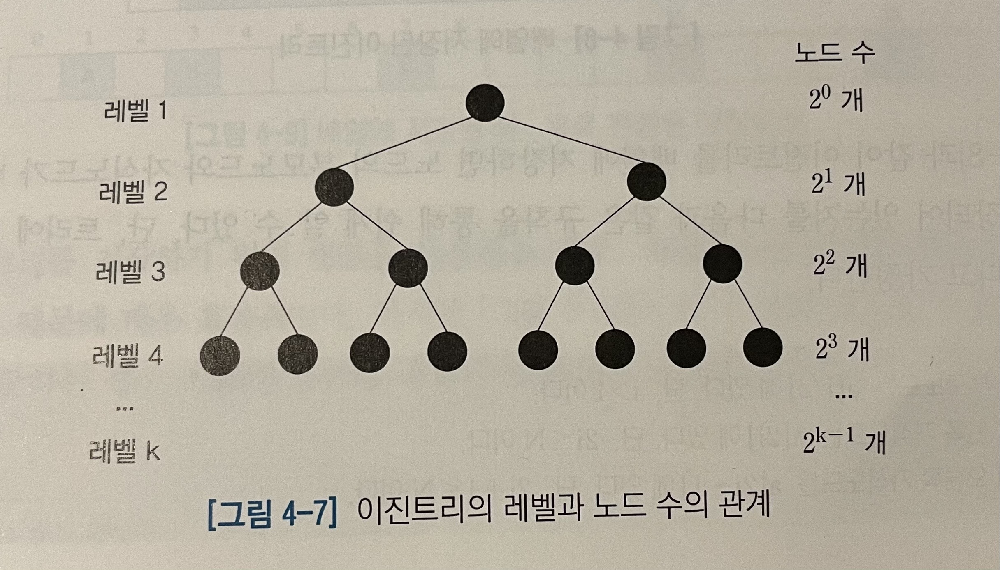

# 4. 트리
배열이나 연결리스트의 문제점을 보완한 계층적 자료구조인 트리는 일반적인 트리와 이진 트리로 구분된다.

## 4.1 트리
일반적인 트리는 empty이거나, empty가 아니면 루트노드 R과 트리의 집합으로 구성되는데 각 트리의 루트노드는 R의 자식노드이다. 단, 트리의 집합은 공집합일 수도 있다.   
주로 HTML과 XML의 문서트리, 자바 클래스의 계층구조, 운영체제의 파일시스템, 탐색트리, 이항힙, 피보나치힙과 같은 우선순위큐에서 사용되는 자료구조이다.

[용어]
* 루트노드 : 트리의 최상위에 있는 노드
* 자식노드 : 노드 하위에 연결된 노드
* 차수 : 자식노드 수
* 부모노드 : 노드의 상위에 연결된 노드
* 이파리노드 : 자식이 없는 노드
* 형제노드 : 동일한 부모를 가지는 노드
* 조상노드 : 루트노드까지의 경로상에 있는 모든 노드들의 집합
* 후손노드 : 노드 아래로 매달린 모든 노드들의 집합
* 서브트리 : 노드 자신과 후손노드로 구성된 트리
* 레벨 : 루트노드가 레벨 1에 있고, 아래층으로 내려가며 레벨이 1씩 증가한다.
* 높이 : 트리의 최대 레벨
* 키(key) : 탐색에 사용되는 노드에 저장된 정보



최대차수가 클수록 메모리의 낭비가 심해지는 것은 물론 트리를 탐색하는 과정에서 null 레퍼런스를 확인해야 하므로 시간적으로도 매우 비효율적이다. 이러한 단점을 보완해주기 위해 `왼쪽자식-오른쪽형제(Left Child-Right Sibling)`
표현을 사용한다. 이 자료구조는 노드의 왼쪽 자식과 왼쪽 자식의 오른쪽 형제노드를 가리키는 2개의 레퍼런스만을 사용하여 표현한다.



## 4.2 이진트리
이진트리는 각 노드의 자식 수가 2 이하인 트리로 컴퓨터 분야에서 널리 활용되는 기본적인 자료구조이다. 이유는 데이터의 구조적인 관계를 잘 반영하고, 효율적인 삽입과 탐색을 가능하게 하며 이진트리의 
서브트리를 다른 이진트리의 서브트리와 교환하는 것이 쉽기 때문이다.

이진트리는 empty이거나 empty가 아니면 루트노드와 2개의 이진트리인 왼쪽 서브트리와 오른쪽 서브트리로 구성된다.

이진트리는  두 종류의 형태를 가지는데
* 포화이진트리 : 모든 이파리노드의 깊이가 같고 각 내부노드가 2개의 자식노드를 가지는 트리이다.
* 완전이진트리 : 마지막 레벨을 제외한 각 레벨이 노드들로 꽉 차있고, 마지막 레벨에는 노드들이 왼쪽부터 빠짐없이 채워진 트리이다.



[이진트리의 연산속성]
* 레벨 k에 있는 최대 노드 수는 2ᴷ⁻¹이다. 단 k=1,2,3...
* 높이가 h인 포화이진트리에 있는 노드 수는 2ʰ-1이다.
* N개의 노드를 가진 완전이진트리의 높이는 [log₂(N+1)]이다.



한 층에 존재할 수 있는 최대 노드 수는 이전 층에 있는 최대 노드 수의 2배인데 이는 이전 층에 있는 각 노드가 최대 2개의 자식노드를 가질 수 있기 때문이다.

이진트리를 1차원 배열 a로 사용한 경우 a[0]은 사용하지 않고, 트리의 레벨 1부터 내려가며 각 레벨에서는 좌에서 우로 트리의 노드들을 a[1]부터 차례로 저장한다.   
그러면 다음의 규칙을 통해 노드의 부모노드와 자식노드가 어디에 위치하는지 알 수 있다.
* a[i]의 부모노드는 a[i/2]에 있다. (단, i > 1)
* a[i]의 왼쪽 자식노드는 a[2i]에 있다. (단, 2i ≤ N)
* a[i]의 오른쪽 자식노드는 a[2i + 1]에 있다. (단, 2i + 1 ≤ N)

완전이진트리를 저장하기 위해 배열을 사용하는 경우, 레퍼런스를 저장할 메모리 공간이 필요 없기 때문에 매우 효율적이다. 하지만 '편향이진트리'를 배열에 저장하는 경우 트리의 높이가 커질수록 메모리 낭비가 커진다.

```
public class Node<Key extends Comparable<Key>> {
    private key item;
    private Node<Key> left;
    private Node<Key> right;
    
    public Node(Key newItem, Node lt, Node rt) { //생성자
        item = newItem;
        left = lt;
        right = rt;
    }
    
    //getter, setter...
}
```
```
public class BinaryTree<Key extends Comparable<Key>> {
    private Node root;
    public BinaryTree() {root = null;}
    ....
}
```
