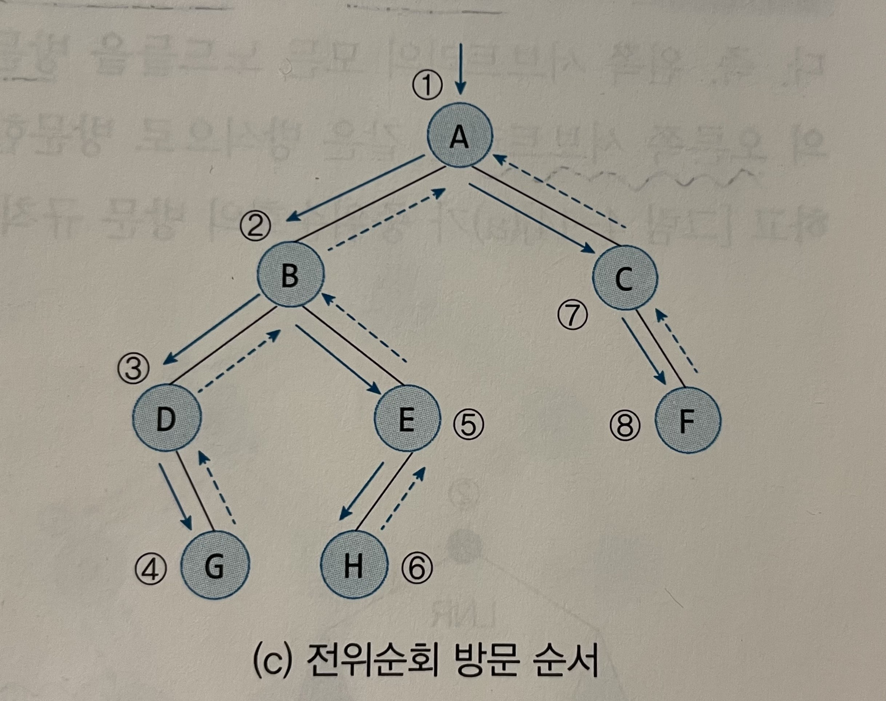
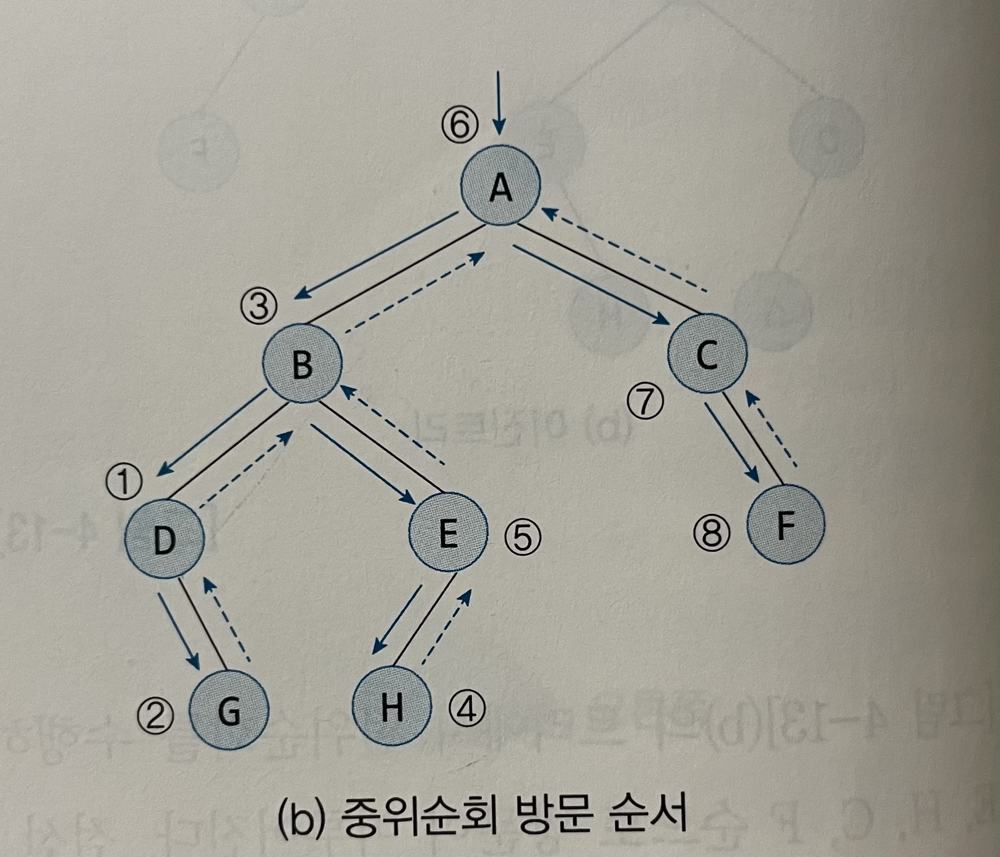
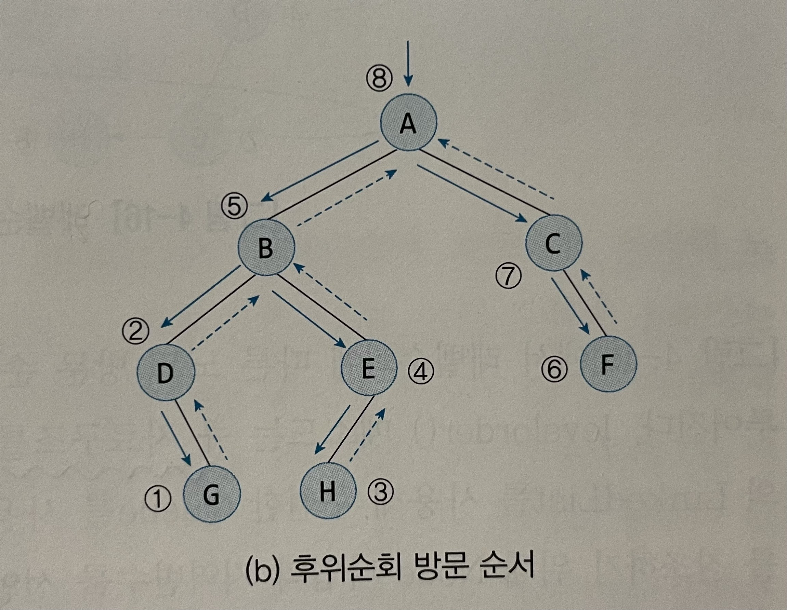
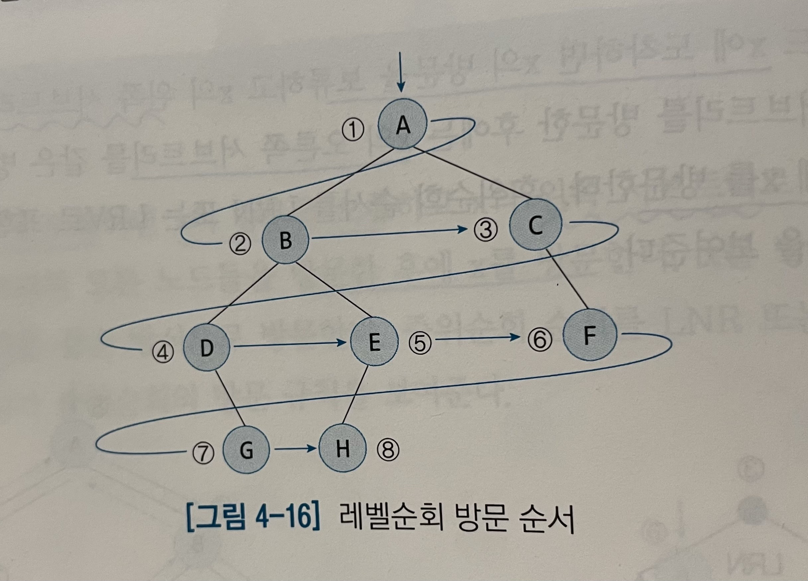
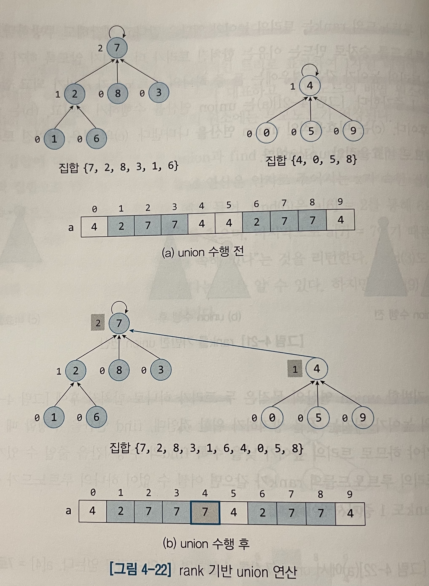
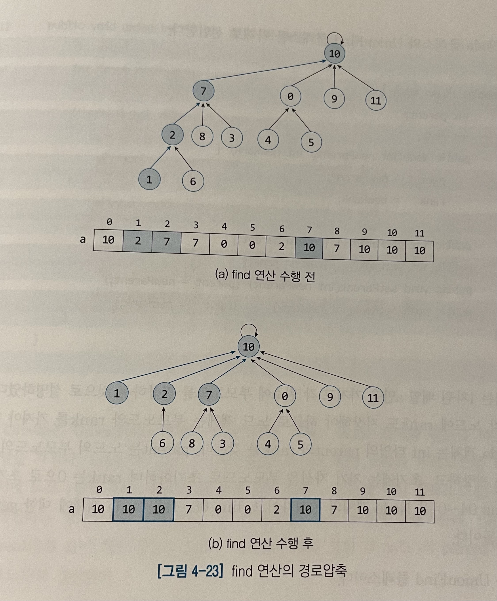

# 4. 트리
배열이나 연결리스트의 문제점을 보완한 계층적 자료구조인 트리는 일반적인 트리와 이진 트리로 구분된다.

## 4.1 트리
일반적인 트리는 empty이거나, empty가 아니면 루트노드 R과 트리의 집합으로 구성되는데 각 트리의 루트노드는 R의 자식노드이다. 단, 트리의 집합은 공집합일 수도 있다.   
주로 HTML과 XML의 문서트리, 자바 클래스의 계층구조, 운영체제의 파일시스템, 탐색트리, 이항힙, 피보나치힙과 같은 우선순위큐에서 사용되는 자료구조이다.

[용어]
* 루트노드 : 트리의 최상위에 있는 노드
* 자식노드 : 노드 하위에 연결된 노드
* 차수 : 자식노드 수
* 부모노드 : 노드의 상위에 연결된 노드
* 이파리노드 : 자식이 없는 노드
* 형제노드 : 동일한 부모를 가지는 노드
* 조상노드 : 루트노드까지의 경로상에 있는 모든 노드들의 집합
* 후손노드 : 노드 아래로 매달린 모든 노드들의 집합
* 서브트리 : 노드 자신과 후손노드로 구성된 트리
* 레벨 : 루트노드가 레벨 1에 있고, 아래층으로 내려가며 레벨이 1씩 증가한다.
* 높이 : 트리의 최대 레벨
* 키(key) : 탐색에 사용되는 노드에 저장된 정보


최대차수가 클수록 메모리의 낭비가 심해지는 것은 물론 트리를 탐색하는 과정에서 null 레퍼런스를 확인해야 하므로 시간적으로도 매우 비효율적이다. 이러한 단점을 보완해주기 위해 `왼쪽자식-오른쪽형제(Left Child-Right Sibling)`
표현을 사용한다. 이 자료구조는 노드의 왼쪽 자식과 왼쪽 자식의 오른쪽 형제노드를 가리키는 2개의 레퍼런스만을 사용하여 표현한다.


## 4.2 이진트리
이진트리는 각 노드의 자식 수가 2 이하인 트리로 컴퓨터 분야에서 널리 활용되는 기본적인 자료구조이다. 이유는 데이터의 구조적인 관계를 잘 반영하고, 효율적인 삽입과 탐색을 가능하게 하며 이진트리의 
서브트리를 다른 이진트리의 서브트리와 교환하는 것이 쉽기 때문이다.

이진트리는 empty이거나 empty가 아니면 루트노드와 2개의 이진트리인 왼쪽 서브트리와 오른쪽 서브트리로 구성된다.

이진트리는  두 종류의 형태를 가지는데
* 포화이진트리 : 모든 이파리노드의 깊이가 같고 각 내부노드가 2개의 자식노드를 가지는 트리이다.
* 완전이진트리 : 마지막 레벨을 제외한 각 레벨이 노드들로 꽉 차있고, 마지막 레벨에는 노드들이 왼쪽부터 빠짐없이 채워진 트리이다.


[이진트리의 연산속성]
* 레벨 k에 있는 최대 노드 수는 2ᴷ⁻¹이다. 단 k=1,2,3...
* 높이가 h인 포화이진트리에 있는 노드 수는 2ʰ-1이다.
* N개의 노드를 가진 완전이진트리의 높이는 [log₂(N+1)]이다.


한 층에 존재할 수 있는 최대 노드 수는 이전 층에 있는 최대 노드 수의 2배인데 이는 이전 층에 있는 각 노드가 최대 2개의 자식노드를 가질 수 있기 때문이다.

이진트리를 1차원 배열 a로 사용한 경우 a[0]은 사용하지 않고, 트리의 레벨 1부터 내려가며 각 레벨에서는 좌에서 우로 트리의 노드들을 a[1]부터 차례로 저장한다.   
그러면 다음의 규칙을 통해 노드의 부모노드와 자식노드가 어디에 위치하는지 알 수 있다.
* a[i]의 부모노드는 a[i/2]에 있다. (단, i > 1)
* a[i]의 왼쪽 자식노드는 a[2i]에 있다. (단, 2i ≤ N)
* a[i]의 오른쪽 자식노드는 a[2i + 1]에 있다. (단, 2i + 1 ≤ N)

완전이진트리를 저장하기 위해 배열을 사용하는 경우, 레퍼런스를 저장할 메모리 공간이 필요 없기 때문에 매우 효율적이다. 하지만 '편향이진트리'를 배열에 저장하는 경우 트리의 높이가 커질수록 메모리 낭비가 커진다.

```
public class Node<Key extends Comparable<Key>> {
    private key item;
    private Node<Key> left;
    private Node<Key> right;
    
    public Node(Key newItem, Node lt, Node rt) { //생성자
        item = newItem;
        left = lt;
        right = rt;
    }
    
    //getter, setter...
}
```
```
public class BinaryTree<Key extends Comparable<Key>> {
    private Node root;
    public BinaryTree() {root = null;}
    ....
}
```

## 4.3 이진트리의 연산
이진트리에서 수행되는 기본 연산들은 트리를 순회하며 이루어진다. 트리를 순회하는 방식은 4가지로 나누지만 순회는 항상 트리의 루트노드부터 시작하고, 트리의 모든 노드들을 반드시 1번씩 방문해야 순회가 종료된다.

### 전위순회
노드 x에 도착했을 때 x를 먼저 방문하고 그 다음에 x의 왼쪽 자식노드로 순회를 계속한다. 왼쪽 서브트리의 모든 노드를 방문한 후 x의 오른쪽 서브트리의 모든 후손 노드들을 방문한다.



```
//루트노드를 인자로 전달
public void preorder(Node n) {
    if(n != null) {
        System.out.println(n.getKey()+" "); //노드 n방문
        preorder(n.getLeft());              //n의 왼쪽 서브트리를 순회
        preorder(n.getRight());             //n의 오른쪽 서브트리를 순회
    }
}
```

### 중위순회
노드 x에 도착하면 x의 방문을 보류하고 x의 왼쪽 서브트리로 순회를 진행한다. 왼쪽 서브트리의 모든 노드들을 방문한 후에 x를 방문한다. x를 방문한 후 x의 오른쪽 서브트리를 같은 방식으로 방문한다.



```
public void inorder(Node n) {
    if(n != null) {
        inorder(n.getLeft());
        System.out.println(n.getKey() + " ");
        inorder(n.getRight());
    }
}
```

### 후위순회
노드 x에 도착하면 x의 방문을 보류하고 x의 왼쪽 서브트리로 순회를 진행한다. 왼쪽 서브트리를 방문한 후 x의 오른쪽 서브트리를 같은 방식으로 방문한다. 그리고 마지막에 x를 방문



```
public void postorder(Node n) {
    if(n != null) {
        postorder(n.getLeft());
        postorder(n.getRight());
        System.out.println(n.getKey() + " ");
    }
}
```

### 레벨순회
루트도느가 있는 최상위 레벨부터 시작하여 각 레벨마다 좌에서 우로 노드들을 방문한다.



```
public void levelorder(Node root) {
    Queue<Node> q = new LinkedList<Node>();
    Node t;
    q.add(root);    //루트노드 큐에 삽입
    while(!q.isEmpty()) {
        t = q.remove(); //큐에서 가장 앞에 있는 노드 제거
        System.out.println(t.getKey() + " ");   //제거된 노드 출력
        if(t.getLeft() != null) q.add(t.getLeft()); //제거된 왼쪽 자식이 null이 아니면 큐에 왼쪽 자식 삽입
        if(t.getRighr() != null) q.add(t.getRight());   //제거된 오른쪽 자식이 null이 아니면 큐에 오른쪽 자식 삽입
    }
}
```

### 트리의 노드 수 계산
트리의 노드 수 = 1 + (루트노드의 왼쪽 서브트리에 있는 노드 수) + (루트노드의 오른쪽 서브트리에 있는 노드 수)
```
public int size(Node n) {
    if(n == null) return 0;
    else return (1+size(n.getLeft()) + size(n.getRight());
}
```

### 트리의 높이 계산
트리의 높이 = 1 + max(루트노드의 왼쪽 서브트리의 높이, 루트노드의 오른쪽 서브트리의 높이)이다.
```
public int height(Node n) {
    if(n == null) return 0;
    //왼쪽과 오른쪽 중 값이 큰 것에 대해 + 1 한 값이 높이
    else return(1 + Math.max(height(n.getLeft()), height(n.getRight())));
}
```

### 이진트리 비교
전위순회 과정에서 다른 점이 발견되는 순간 false를 리턴한다. 2개의 이진트리가 동일한지 검사하는 메소드는 두 트리의 루트노드들을 인자로 전달하여 호출한다.
```
public static boolean isEquals(Node n, Node m) {
    if(n==null || m==null) return n == m;
    
    if(n.getKey().compareTo(m.getKey()) != 0) return false; //둘다 null이 아니면 item을 비교하낟.
    
    return(isEqual(n.getLeft(), m.getLeft()) && isEqual(n.getRight(), m.getRight()));
}
```

앞서 설명된 각 연산은 트리의 각 노드를 한 번씩만 방문하므로 O(N)시간이 소요된다.

### 스레드 이진트리
앞서 살펴본 이진트리의 기본 연산들은 레벨순회를 제외하고 모두 스택 자료구조를 사용한다. 스택에 사용되는 메모리 공간의 크기는 트리의 높이에 비례한다.   
스택없이 이진트리의 연산을 구현하는 방법에는 1)Node에 부모 노드를 가리키는 레퍼런스 필드를 추가로 선언하여 순회하는 방법 2)노드의 null 레퍼런스들을 활용하는 법(null 레퍼런스 공간에 다음에 방문할 노드의 레퍼런스를 저장)
이렇게 만든 이진트리를 '스레드 이진트리'라고 한다.

N개의 노드가 있는 이진트리에는 N+1개의 null 레퍼런스 필드가 있고 각 노드마다 2개의 레퍼런스 필드가 있으므로 총 2N개의 레퍼런스 필드가 존재한다. 이중에서 부모 자식을 연결하는 레퍼런스는 N-1개이다.(루트노드 제외하고 각 노드가 1개의 부모노드를 갖기 때문)   
스레드 이진트리는 N+1개의 null 레퍼런스를 활용하여 이전에 방문한 노드와 다음에 방문할 노드를 가리키도록 만들어 순회 연산이 스택 없이도 수행될 수 있도록 만든 트리이다.

대부분의 경우 `중위 순회`에 기반하여 구현되고, 스택을 사용하는 순회보다 빠르고 메모리 공간도 적게 차지한다는 장점을 갖지만 데이터의 삽입과 삭제가 잦은 경우 그 구현이 비교적 복잡한 편이므로 좋은 성능을 보여주지 못한다.

## 4.4 상호배타적 집합을 위한 트리 연산
어느 두 집합도 중복된 원소를 갖지 않는 경우 '상호 배타적 집합'이라고 한다. 상호배타적 집합에 대해 수행할 연산은 `union과 find`연산이다. union은 2개의 집합을 하나의 집합으로 만드는 연산이고, find는 인자로 주어지는 x가 속한 집합의 대표노드 즉 루트노드를 찾는 연산이다.

union연산은 rank에 기반하여 rank가 높은 루트노드가 union 후에도 루트노드가 되도록 한다. 이는 두 트리가 합쳐진 후 트리의 높이가 커지는 것을 방지하기 위한 것이다.



find 연산을 수행하면서 루트노드까지 올라가는 경로 상의 각 노드의 부모노드를 루트노드로 갱신한ㄴ다 => 경로 압축



경로압축은 당장 find(1)의 수행시간이 줄지는 않으나, 추후의 find(1), find(2)의 수행시간을 단축한다.(경로압축으로 인해 루트노드의 rank는 트리의 높이와 달라질 수 있다.)

```
public class Node {
    int parent;
    int rank;
    
    public Node(int newParent, int newRank) {
        parent = newParent;
        rank = newRank;
    }
    
    //getter, setter
}

public class UnionFind {
    protected Node[] a;
    public UnionFind(Node[] iarray) {
        a = iarray;
    }
    
    protected int find(int i) { //경로압축
        if(i != a[i].getParent())
            a[i].setParent(find(a[i].getParent()));
        return a[i].getParent();
    }
    
    public void union(int i, int j) { //union연산
        //i와 j의 root 노드를 찾는다.
        int iroot = find(i);   
        int jroot = finr(j);
        
        //root 노드가 같으면 union 수행을 하지 않는다.
        if(iroot == jroot) return;
        
        //root 노드가 다르면 rank가 높은 루트노드가 승자가 된다.
        if(a[iroot].getRank() > a[jroot].getRank())
            a[jroot].setParent(iroot);
        else if (a[iroot].getRank() < a[jroot].getRank())
            a[iroot].setParent(jroot);
        else {
            a[jroot].setParent(iroot);  //둘 중 하나가 임의로 승자가 됨
            int t = a[iroot].getRank() + 1; //승자 rank를 1 증가시킨다.
            a[iroot].setRank(t);
        }    
    }
}
```

수행시간 = find 연산을 제외한 순수 union 연산의 수행시간은 O(1) 시간이다. find 연산의 수행시간은 최대 트리의 높이만큼 올라가야 하므로 트리의 높이에 비례한다.
find 연산을 수행하며 경로 압축을 하므로 경로 상의 노드에 대해 추후에 수행되는 find 연산의 수행시간은 트리의 높이보다는 적게 걸린다.

상각분석결과 1회의 find 연산의 수행시간이 O(log*N)이다.