# 5. 탐색트리
저장된 데이터에 대해 탐색, 삽입, 삭제, 갱신 등의 연산을 수행할 수 있는 자료구조를 Dictionary라고 일컫는다.   
배열, 연결리스트는 사전이지만 각 연산을 수행하는데 선형시간[O(n)]이 소요된다는 단점이 있고, 스택이나 큐는 특정 작업에 적합한 자료구조이나 사전 자료구조로 볼 수 없다.   
탐색트리는 리스트 자료구조의 수행시간을 향상시키기 위한 트리 형태의 자료구조이다.

## 5.1 이진탐색트리
이진탐색은 정렬된 데이터의 중간에 위치한 항목을 기준으로 데이터를 두 부분으로 나누어 가며 특정 항목을 찾는 탐색방법이다. 연결리스트의 중간 노드를 중심으로 좌측 노드들은
이전 노드를 가리키도록 하고, 우측 노드는 이후 노드를 가리키도록 한다. 그리고 연결리스트의 중간 노드를 위로 끌어당기면 트리 형식이 된다.

__이진탐색트리는 이진 탐색을 수행하기 위해 단순연결리스트를 변형시킨 자료구조이다__

이진탐색트리의 특징으로 트리를 '중위순회'하면 정렬된 출력을 얻는다는 것이다. 이진탐색트리는 가장 기본적인 트리 형태의 자료구조이고, 데이터베이스 등의 대용량 데이터 저장의 기본 개념으로도 활용된다.

이진탐색트리의 조건: 각 노드 n의 키 값이 n의 왼쪽 서브트리에 있는 노드들의 키값들보다 크고, n의 오른쪽 서브트리에 있는 노드들의 키값들보다 작다.

1) 이진탐색트리 구현시 노드 객체는 id, name, 왼쪽자식, 오른쪽자식 필드를 갖는다.
2) 탐색연산 : 탐색은 항상 루트노드에서 시작하고, 탐색하고자 하는 key와 루트노드의 id를 비교하는 것으로 탐색을 시작한다. (key < id 이면 왼쪽 서브트리에서 key를 찾고, key > id 이면 오른쪽 서브트리에서 key를 찾는다. 탐색 성공시 해당노드의 value인 name을 리턴)
3) 삽입연산 : 탐색 연산과 거의 동일하다. 탐색 연산 마지막에서 null이 반환되는 상황에서 null을 반환하는 대신 새로운 노드를 생성하고 노드를 부모노드와 연결하면 된다.
4) 삭제연산 : 탐색 과정을 거친뒤 삭제할 노드를 찾고, 삭제 노드의 부모노드와 자식노드들을 연결해 주어야 한다. 이를 위해 삭제 노드가 자식이 없는 경우 case0, 자식이 하나인 경우 case1, 자식이 둘인 경우 case2로 나누어 delete 연산을 수행
```
public void delete(Key k) {
    root = delete(root, k);
}

public Node delete(Node n, Key k) {
    if(n == null) return null;
    int t = n.getKey().compareTo(k);
    
    if(t > 0) n.setLeft(delete(n.getLeft()), k));       //왼쪽 자식으로 이동
    else if(t < 0) n.setRight(delete(n.getRight(), k);  //오른쪽 자식으로 이동
    //삭제할 노드 발경
    else {
        if(n.getRight() == null) return n.getLeft();
        if(n.getLeft() == null) return n.getRight();
        Node target = n;
        n = min(target.getRight());
        n.setRight(deleteMin(target.getRight()));
        n.setLeft(target.getLeft());
    }
    return n;
}
```
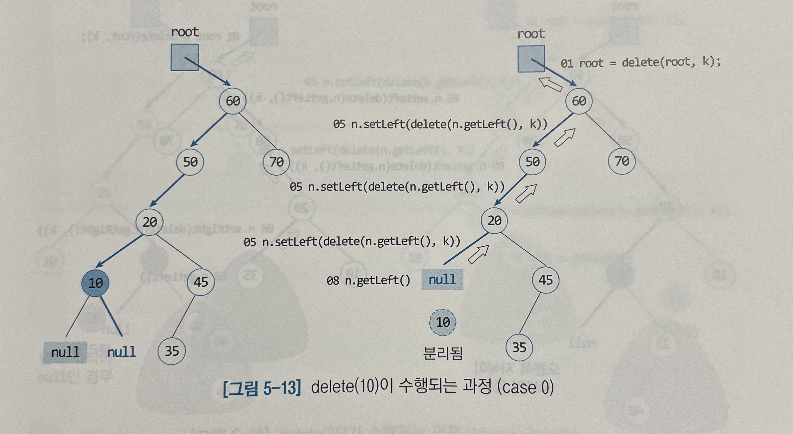

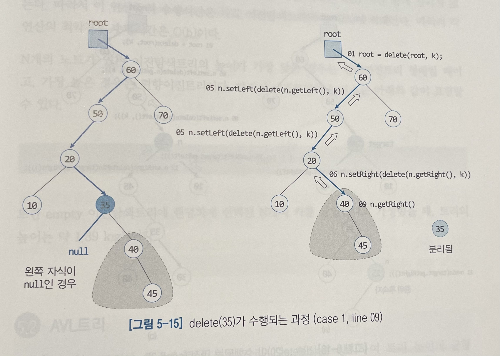

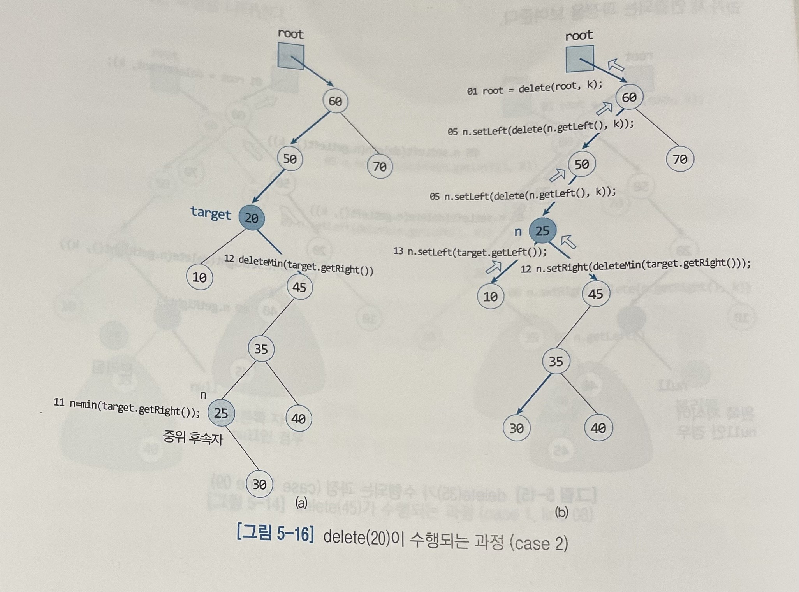

__최솟값 찾기__ : 루트노드로부터 왼쪽 자식노드를 따라 내려가며 null을 만났을 때 null의 부모노드가 가진 id가 최솟값이다.
```
public Key min() {
    if(root == null) return null;
    return (Key) min(root).getKey();
}

//인자로 전달받은 노드가 null이 아닌한 계속 왼쪽 자식을 인자로 넘겨 min 메소드를 재귀호출
private Node min(Node n) {
    if(n.getLeft() == null) return n;   //null이면 부모 노드를 리턴한다.
    return min(n.getLeft());            //null을 만날때까지 재귀호출
}
```

__최솟값 삭제__ : 최솟값 x를 찾은 뒤, x의 부모노드 p와 x의 오른쪽 자식노드 c를 연결하면 된다. 이때 c가 null이라도 자식으로 삼아 연결한다.
```
public void deleteMin() {
    if(root == null) System.out.println("empty 트리");
    root = deleteMin(root);
}

public Node deleteMin(Node n) {
    if(n.getLeft() == null) return n.getRight();
    n.setLeft(deleteMin(n.getLeft()));
    return n;
}
```

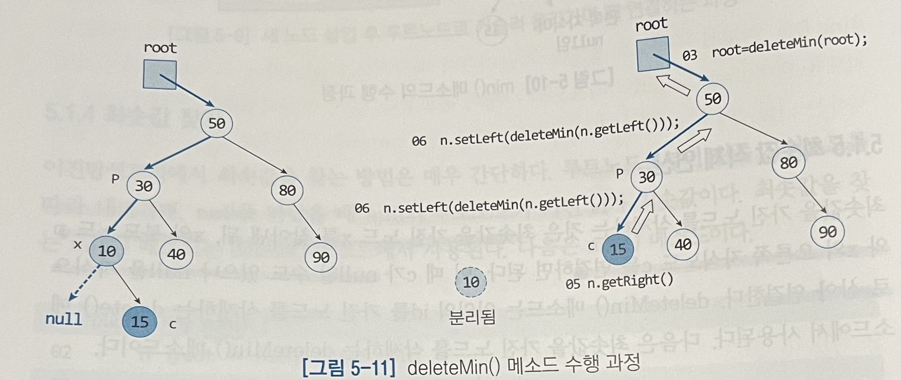

## 5.2 AVL 트리
AVL트리는 트리가 한 쪽으로 치우쳐 자라나는 현상을 방지하여 트리 높이의 균형을 유지하는 이진탐색트리이다. N개의 노드를 가진 트리의 높이가 O(logN)이 되어 탐색, 삽입, 삭제 연산의 수행시간이 O(logN)으로 보장된다.   
AVL트리는 삽입, 삭제로 인하여 균형이 깨지면 `회전 연산`을 통해 트리의 균형을 유지한다.

AVL트리는 임의의 노드 x에 대해 x의 왼쪽 서브트리의 높이와 오른쪽 서브트리의 높이의 차이가 1을 넘지 않는 이진탐색트리이다.

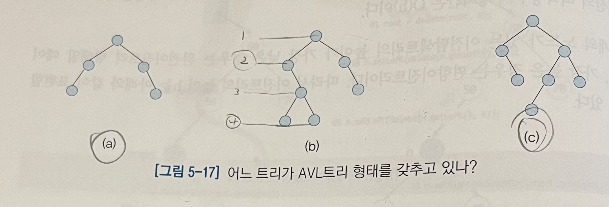

A(h) = 높이가 h인 AVL트리를 구성하는 최소의 노드 수로 보면 A(1)=1, A(2)=2, A(3)=4 ...이다. 이는 피보나치 수 F(h)와 관계있음을 알 수 있다.

AVL트리에서 탐색연산은 이진트리의 탐색 연산과 동일하고, 삽입 삭제 연산에서 불균형 발생시 균형을 유지하기 위해 4종류의 회전 연산을 한다.

### 회전연산
기본적으로 두 종류의 연산으로 구분된다. 1)왼쪽 서브트리가 높아서 불균형 발생시 오른쪽 방향으로 회전하는 rotateRight, 2)오른쪽 서브트리가 높아서 불균형 발생시 왼쪽 방향으로 회전하는 rotateLeft

```
private Node rotateRight(Node n) {
    Node x = n.left;
    n.left = x.right;
    x.right = n;
    n.height = tallerHeight(height(n.left), height(n.right)) + 1;   //높이 갱신
    x.height = tallerHeight(height(x.left), height(x.right)) + 1;   //높이 갱신
    return x;   //회전 후 x가 n의 이전 자리로 이동되었으므로
}
```
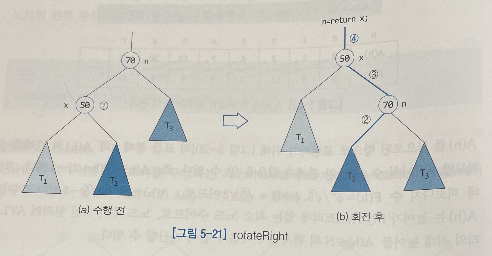

```
private Node rotateLeft(Node n) {
    Node x = n.right;
    n.right = x.left;
    x.left = n;
    n.height = tallerHeight(height(n.left), height(n.right)) + 1;
    x.height = tallerHeight(height(x.left), height(x.right)) + 1;
    return x;
}
```
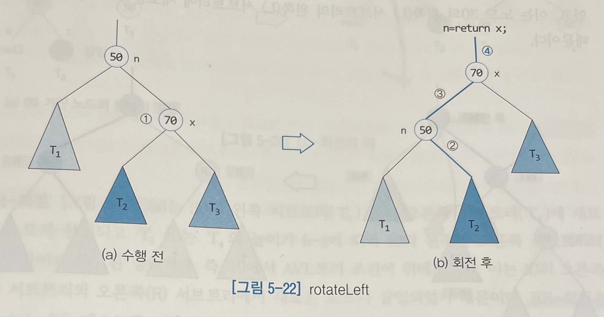

__LL-회전__ : 왼쪽 서브트리로 쏠려있는 형태 rotateRight() 메소드를 이용하면 된다.

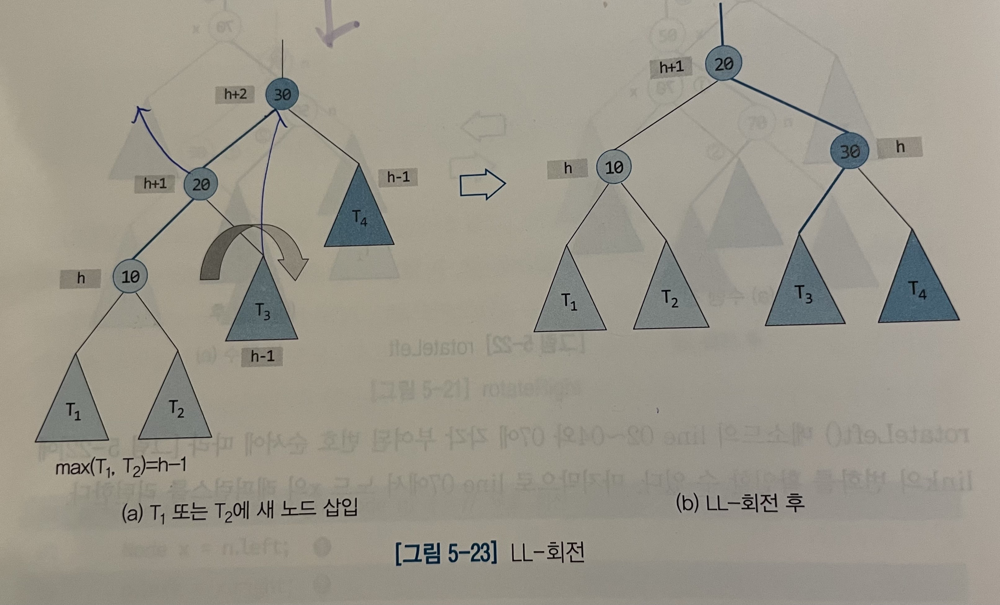

__RR-회전__ : 오른쪽 서브트리로 쏠려있는 형태 rotateLeft() 메소드를 이용하면 된다.

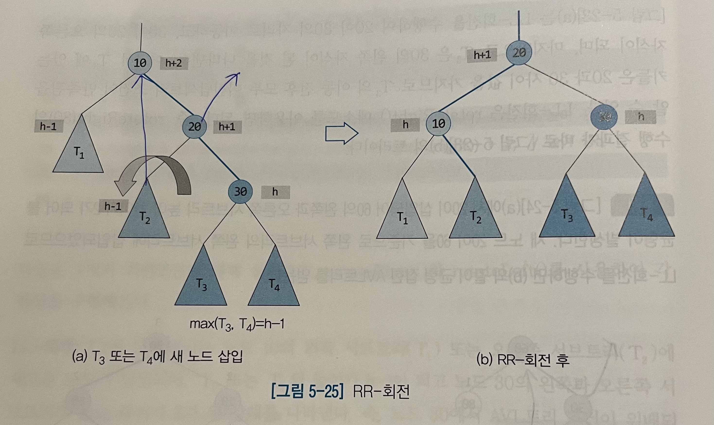

__LR-회전__ : rotateLeft()를 먼저 수행한 뒤, rotateRight()를 수행한다.

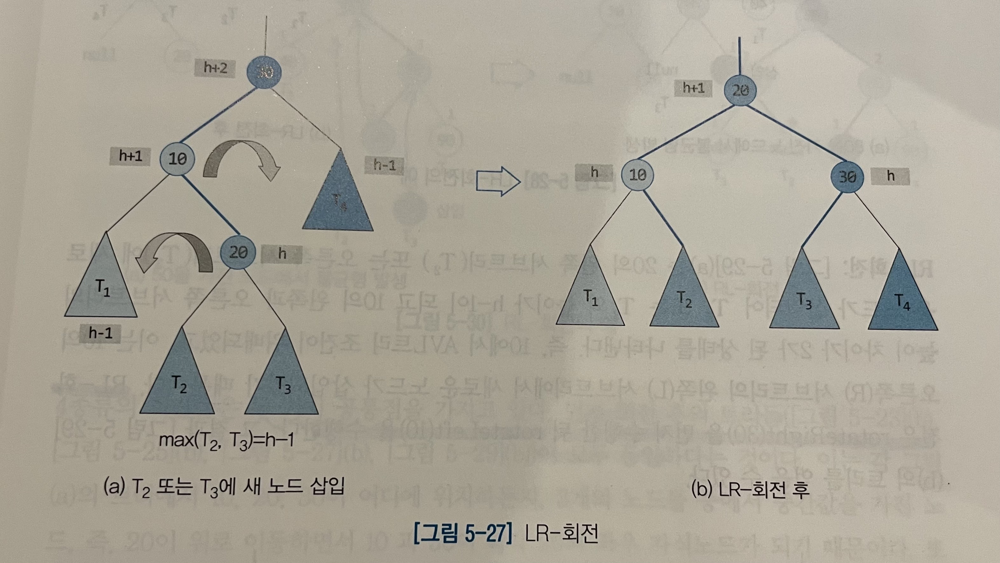

__RL-회전__ : rotateRight()을 먼저 수행한 뒤, rotateLeft()를 수행한다.

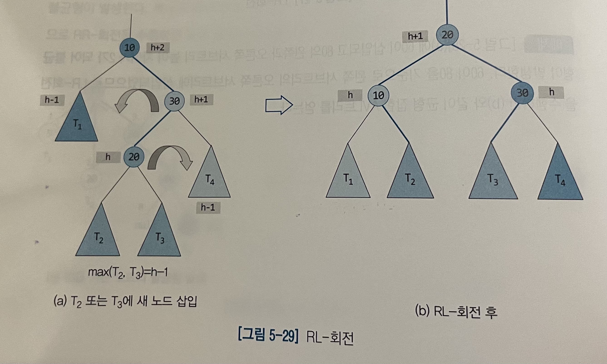

위 4종류의 회전들은 두 가지 공통점을 가진다.
1) 회전 후의 트리들이 모두 동일하다.
2) 회전 연산 수행시간이 O(1)시간이다.

### 삽입연산
AVL트리에서 삽입은 2단계로 수행된다. 1)이진탐색트리의 삽입과 동일하게 새로운 노드를 삽입 2)새로 삽입한 노드로부터 루트노드로 거슬러 올라가며 각 노드의 서브트리 높이 차이를 갱신
불균형이 발생한 노드를 발견하면 이 노드를 기준으로 새 노드가 어디에 삽입되었는가에 따라 적절한 회전연산을 수행한다.

```
public void put(Key k, Value v) {
    return root = put(root, k, v);
}

public void put(Node n, Key k, Value v) {
    if(n == null) return new Node(k, v, 1);
    int t = k.compareTo(n.id)l
    if(t < 0) n.left = put(n.left, k, v);
    else if(t > 0) n.right = put(n.right, k, v);
    else {
        n.name = v;
        return n;
    }
    n.height = tallerHeight(height(n.left), height(n.right)) + 1;
    return balance(n);
}

private Node balance(Node n) {
    //LR회전
    if(bf(n) > 1) {
        if(bf(n.left) < 0) {
            n.left = rotateLeft(n.left);
        }
        n = rotateRight(n);
    }
    //RL회전
    else if(bg(n) < -1) {
        if(bf(n.right) > 0) {
            n.right = rotateRight(n.right);
        }
        n = rotateLeft(n);
    }
    return n;
}

private int bf(Node n) {
    return height(n.left) = height(n.right);
}
```

### 삭제연산
AVL트리에서 삭제는 2단계로 수행된다. 1)이진탐색트리의 삭제와 동일하게 수행 2)삭제된 노드로분터 루트노드 방향으로 거슬러 올라가며 불균형이 발생한 경우 적절한 회전연산 수행

삭제후 불균형 발생시 반대쪽에 삽입이 이루어져 불균형이 발생한것으로 취급한다. 즉 삭제연산을 삽입연산으로 취급한다.

수행시간은 각 연산의 수행시간은 O(logN)이고, AVL 트리는 거의 정렬된 데이터를 삽입한 후에 랜덤 순서로 데이터를 탐색하는 경우 가장 좋은 성능을 보인다.

## 5.3 2-3 트리
2-3 트리는 내부노드의 차수가 2 또는 3인 균형 탐색트리이다. 차수가 2인 노드를 2-노드(한 개의 키를 가짐), 차수가 3인 노드를 3-노드(두 개의 키를 가짐)라고 부른다.
2-3 트리는 루트노드로부터 각 이파리노드까지 경로의 길이가 같고, 모든 이파리노드들이 동일한 층에 있는 완전한 균형트리이다.   
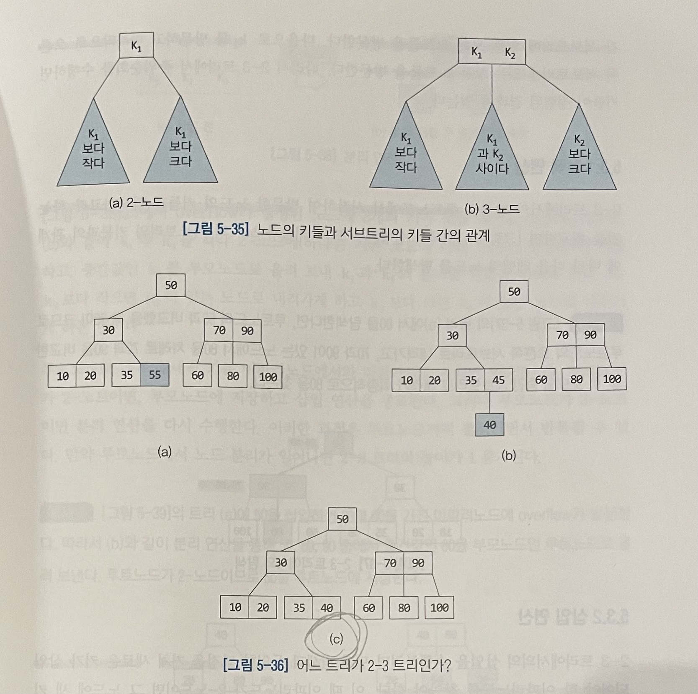

### 탐색 연산
2-3 트리에서 탐색은 루트노드에서 시작하여 방문한 노드의 키들과 탐색하고자 하는 키를 비교하며 노드의 키들과 노드의 서브트리의 키들과의 관계에 따라 다음 레벨의 노드를 탐색한다.

### 삽입 연산
먼저 탐색과 동일한 과정을 거쳐 새로운 키가 삽입되어야 할 이파리노드를 찾아야 한다.   
* 2-노드 : 그 노드에 새 키를 삽입
* 3-노드 : 노드에 있는 두 개의 키와 새로운 키를 비교하여 중간값이 되는 키를 부모 노드로 올려 보내고, 남은 두 개의 키를 각각 별도의 노드에 저장한다. '분리(Split)연산'이라고 한다.

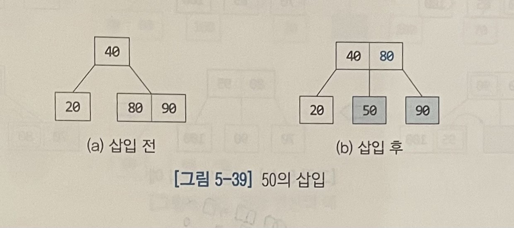   
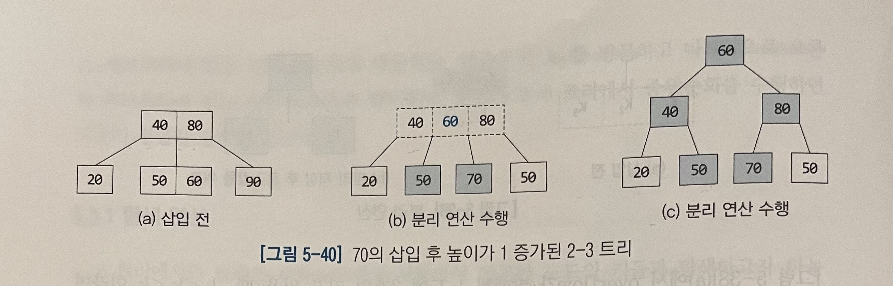

### 삭제 연산
삭제는 항상 이파리노드에서 이루어진다. 만약 삭제할 키가 있는 노드가 이파리노드가 아닌 경우 이진탐색트리의 삭제와 유사하게 중위 선행자 또는 중위 후속자와 교환한 후에 이파리노드에서 실질적인 삭제를 수행한다.
이를 위해 __이동연산과 통합 연산__ 이 필요하다.

* 이동연산 : 키가 삭제되어 노드가 empty가 되었을 때 이 노드의 형제노드와 부모노드의 도움을 받아 한 개의 키를 empty 노드로 이동시키는 연산이다.(이때 형제노드는 반드시 3-노드여야 한다.) 형제노드를 부모노드로 옮기고 부모노드를 empty 노드로 이동시킨다.   
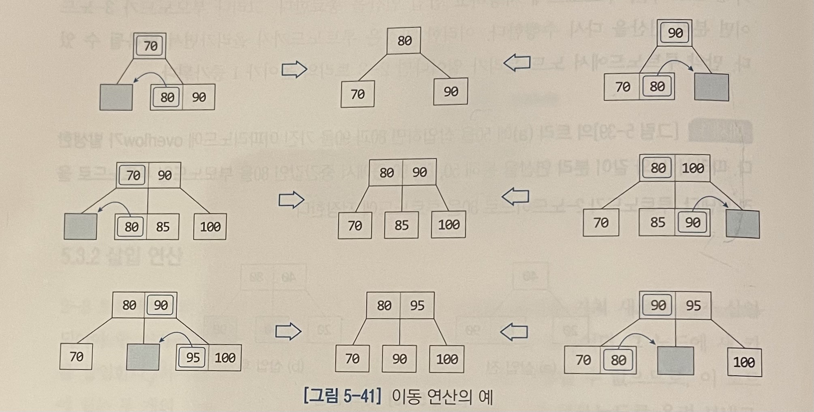   
* 통합연산 : 노드가 empty일 때 이동 연산이 불가능한 경우 empty 노드와 그의 형제 노드를 하나의 노드로 만들고, 부모 노드의 키를 통합된 노드로 끌어내려 저장하는 연산이다.   
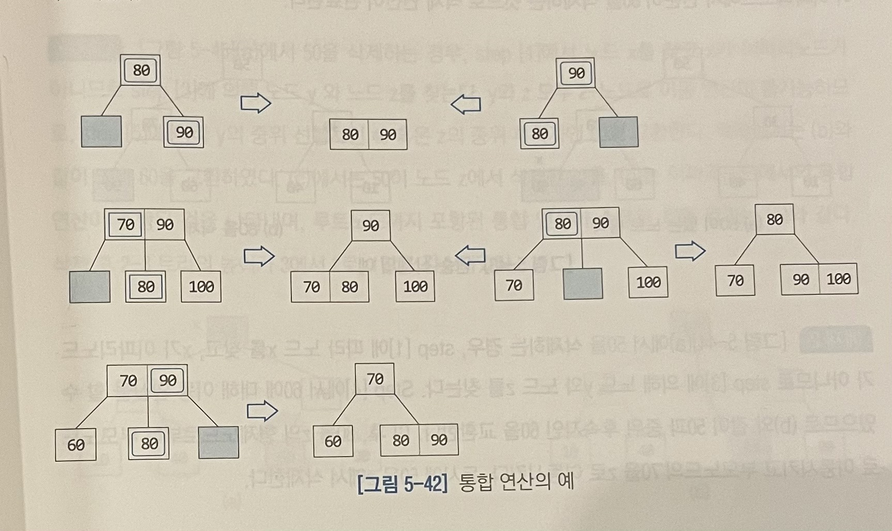   

[삭제연산을 위한 알고리즘]
```
1) 삭제할 키 k가 있는 노드 x를 탐색한다.
2)
if(x == 이파리노드) {
    k를 노드 x에서 삭제
    if(x != empty) {
        알로리즘 종료
    } else {
        if(x의 형제노드 중 3-노드가 있으면) {
            이동연산 수행
        }else {
            통합연산 수행
        }
    }
}
3)
//x != 이파리노드
else {
    k의 중위 선행자가 있는 노드 y와 중위 후속자가 있는 노드 z를 찾는다
    if(y or z에서 이동연산이 가능하면) {
        이동 연산 가능한 노드의 키를 k와 서로 교환하고 이동연산 수행 동시에 k를 삭제한 후 알고리즘 종료
    }else {
        y or z중에서 임의로 선택하여 선택한 노드의 키와 k를 서로 교환 후 k삭제하고 통합연산 수행
    }
}
```

수행시간) 2-3 트리의 탐색, 삽입, 삭제 연산은 각각 트리 높이에 비례하는 시간이 소요된다. 각 연산은 루트노드부터 이파리노드까지 탐색해야 하고, 삽입, 삭제는 분리나 통합 연산을 수행하며 다시 루트노드까지 올라가는 경우도 있기 때문이다.
단, 분리 연산이나 통합 연산은 각각 트리의 지역적인 부분에서만 수행되므로 O(1)시간만 소요된다.

2-3 트리의 가장 높은 경우는 모든 노드가 2-노드인 경우이고. 이때 트리의 높이는 log₂(N+1)이다. 반면 모든 노드가 3-노드일 때 트리의 높이는 최소가 되며, 높이는 log₃N≈0.63 log₂N이다.

따라서 2-3트리의 탐색, 삽입, 삭제 연산의 수행시간은 각각 O(logN)이다.

2-3 트리는 이진탐색트리에 비해 매우 우수한 성능을 보이나 실제로 구현하기에 다소 어려움이 따른다. 

**2-3트리는 좌편향 레드블랙트리의 기본형태를 제공하여 매우 중요한 자료구조이다.

### 2-3-4 트리
노드가 자식노드를 4개까지 가질 수 이는 완전 균형트리이다. 2-3 트리보다 높이가 낮아 그만큼 빠른 탐색, 삽입, 삭제 연산이 수행 가능하다.
특히 삽입 연산을 루트노드부터 이파리노드로 내려가며 4-노드를 만날 때마다 미리 분리 연산을 수행하기 때문에 다시 이파리노드부터 위로 올라가며 분리 연산을 수행할 필요가 없고, 보다 효율적인 삽입 연산이 가능하다.

삭제 연산도 2-노드를 만날때 미리 통합연산을 수행하여 다시 루트노드 방향으로 올라가며 통합연산을 할 필요가 없다. 하지만 이론적으로는 수행시간이 2-3 트리와 동일하다.